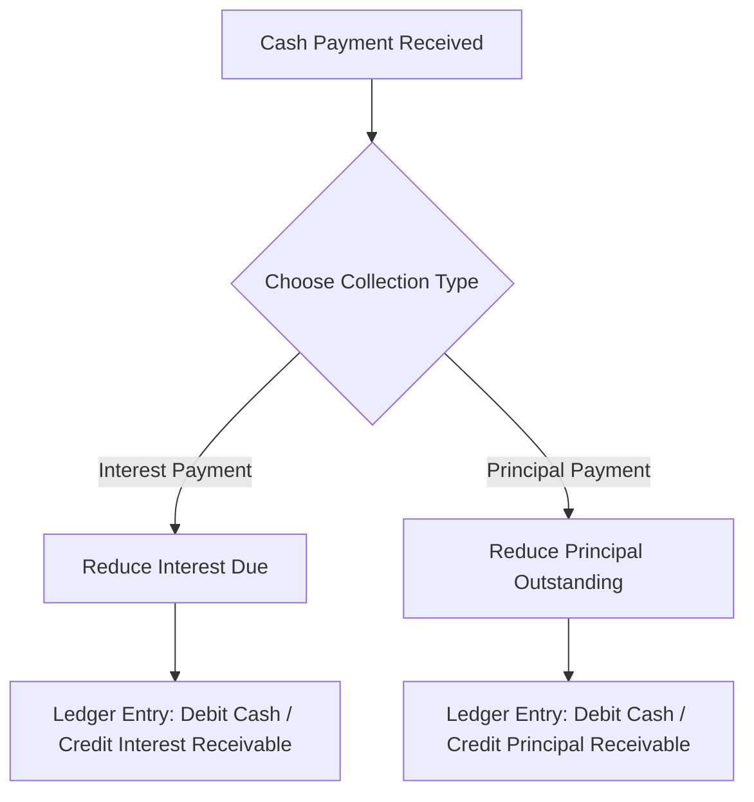

# STN MICRO CREDIT — Comprehensive User Manual & Operations Guide

Welcome to the definitive user manual and operations guide for the **STN MICRO CREDIT** system. This document outlines step-by-step guides for every function in the application, followed by a detailed explanation of the different collection payment types (Interest vs. Principal) and their accounting behaviors.

---

## Table of Contents
1. [General Navigation & Responsive Design](#1-general-navigation--responsive-design)
2. [Step-by-Step Administrator Workflows](#2-step-by-step-administrator-workflows)
   - [User & Staff Management](#user--staff-management)
   - [Issuing a New Loan (Two-Step Wizard)](#issuing-a-new-loan-two-step-wizard)
   - [Reviewing & Auditing Loan Files](#reviewing--auditing-loan-files)
   - [Admin Loan Management Actions](#admin-loan-management-actions)
   - [Agent Remittances (Approving Handovers)](#agent-remittances-approving-handovers)
   - [Double-Entry Ledger Audit Sheet](#double-entry-ledger-audit-sheet)
3. [Step-by-Step Collection Agent Workflows](#3-step-by-step-collection-agent-workflows)
   - [Managing Routes & Field Collections](#managing-routes--field-collections)
   - [Shift Remittance Request](#shift-remittance-request)
4. [Types of Collections Explained (Interest vs. Principal)](#4-types-of-collections-explained-interest-vs-principal)
   - [Interest Collection](#interest-collection)
   - [Principal Collection](#principal-collection)
   - [Double-Entry Ledger Accounting Flows](#double-entry-ledger-accounting-flows)
5. [Operational Rules & Troubleshooting](#5-operational-rules--troubleshooting)

---

## 1. General Navigation & Responsive Design
* **Header & Role Indicator:** The top header displays the logo (**STN MICRO CREDIT**), your active role badge (`Admin` or `Agent`), and a change-password settings button.
* **Navigation Bar:** 
  * On Desktop: Accessible links are listed at the top.
  * On Mobile: A sticky navigation bar appears at the bottom of the screen.
* **Layout Scaling:** Desktop tables automatically transform into swipeable compact cards on mobile, ensuring visual clarity in the field.

---

## 2. Step-by-Step Administrator Workflows

### User & Staff Management

#### **How to Add a New Staff User (Admin or Agent)**
1. Navigate to the **Users & Cash** section from the top or bottom navigation bar.
2. Under the **Users** section, locate the **Add New User** form.
3. Enter the user's **Name**, a unique **Mobile Number** (which acts as their login username), and their **Email** address.
4. Select their **Gender** (Male / Female).
5. Select their **Role** from the dropdown:
   * **Admin:** Full access to all tools, settings, ledgers, and loan modifications.
   * **Agent:** Restricted access. Can only see their assigned customers, record collections on route, and request remittances.
6. Enter a secure temporary password.
7. Click **Create User**. The new user is immediately registered.

#### **How to Edit a User's Profile**
1. On the **Users & Cash** page, find the user in the list (or card list on mobile).
2. Click **Edit Details**. A popup form will appear.
3. Update the user's name, phone, email, gender, or role as needed.
4. Click **Save Changes**.

#### **How to Permanently Delete a User Account**
1. Locate the user under the user list.
2. Click the **Delete** button.
3. A security dialog box will appear asking you to confirm:
   `Are you sure you want to delete this user? Enter your account password to verify this activity.`
4. Enter your administrator password.
5. Click **Confirm**.
   * *Note: The system will block deletions if the user has active collections, remittances, or assigned loans in the history logs to preserve audit trails.*

---

### Issuing a New Loan (Two-Step Wizard)

#### **Step 1: Borrower Details & Interest Scheduler**
1. Navigate to the **Give Loan** section.
2. Under **Step 1: Borrower & Loan Terms**, input:
   * **Borrower Info:** Full Name, Phone (mobile), and NIC Number. Email is optional. Select their Gender (Male / Female).
   * **Financial Profile:** Borrower monthly income and purpose of the loan (e.g. business expansion).
   * **Spouse & Dependents:** Number of dependents, spouse name, spouse NIC, and spouse occupation.
   * **Principal Amount:** Cash amount to disburse (in LKR).
   * **Interest Rate (%)** Rate charged per period (e.g., `3.00%` interest).
   * **Interest Type (Periodicity):** Select **Daily**, **Weekly**, or **Monthly**.
   * **Term Mode:** Select **Open-Ended** (running interest accrual until principal is repaid) or **Fixed Term** (maturity date computed by duration).
   * **Agent Assignment:** Select the field collection agent responsible for this route.
3. Click **Browse NIC Photo** to upload or take a photo of the borrower's identity document.
4. **Guarantor Check:**
   * **If a Guarantor is required:** Check the **Include Guarantor Details** box, and click **Next Step**.
   * **If no Guarantor is required:** Leave the box unchecked and click **Disburse Cash Loan**.

> [!IMPORTANT]
> If any required fields are invalid (e.g., duplicate phone number or incorrect NIC format), the system disables default browser alert popups, writes a descriptive error message in red directly below the field, and automatically scrolls and focuses on the first incorrect field.

#### **Step 2: Guarantor Profile** (Only if "Include Guarantor" was checked)
1. You will be navigated to **Step 2: Guarantor Info**. A stepper menu at the top will indicate your progress.
2. Input the Guarantor's details:
   * **Personal Info:** Name, Phone, and NIC. *(Email and Date of Birth details are omitted).*
   * **Legal Flags:** Specify if they are protected under the debt-recovery act, and check if they have pending court cases.
   * **Finance Profile:** Monthly income and monthly expenses.
3. To go back and correct Step 1 details, click **Back to Step 1**.
4. To complete disbursal, click **Disburse Cash Loan**. The system registers the borrower, guarantor, generates the loan record, and posts the disbursal entries to the ledger.

---

### Reviewing & Auditing Loan Files

#### **How to Search and View a Borrower's File**
1. Navigate to **Check Loans**.
2. Use the search bar at the top to filter loans by borrower name, phone, NIC, or status.
3. Click on the borrower's card or row to open their **Ledger Statement File**.
4. The file will open with the **Passbook & Payments** tab active.

#### **How to Navigate the Loan File Tabs**
* **Passbook & Payments Tab:** Contains a real-time recalculation of interest balances, a chronological passbook activity list, inline payment controls, and a list of historical payments with print buttons.
* **Borrower Profile Tab:** Displays borrower addresses, spouse details, monthly income, and loan purpose.
* **Guarantor Info Tab:** Lists guarantor NIC, legal protection markers, income/expense breakdown, and has buttons to *Edit Guarantor* or *Remove Guarantor*.
* **Manage Loan Tab:** Contains admin-only controls to alter terms, penalties, or write off debt.

#### **How to View and Print the Detailed Passbook Statement**
1. Under **Passbook & Payments**, click on the **Passbook Statement (Activity Log)** card header, or click the **View Detailed Table** button on it.
2. You will navigate to a new full-screen page containing the chronological detailed statement (oldest first).
3. The page displays the borrower name, phone, NIC, and a detailed table with:
   * Date & time of every change.
   * Event type (Loan Disbursed, Interest Added, Payments, Penalties).
   * Detailed calculation logs (e.g. `Principal LKR 10,000 * 3% = LKR 300 interest charge`).
   * Separate running balances for both Principal and Interest.
4. Click **Print Statement**. A print dialog optimized for A4 paper and thermal print layouts will open.
5. Click **Back to Loan File** to return.

---

### Admin Loan Management Actions

#### **How to Record an Inline Payment (Direct Collection)**
1. Open the borrower's ledger file and click the **Passbook & Payments** tab.
2. Locate the **Record a Payment** card in the right column.
3. Click **Interest** or **Principal** to select the payment type.
4. Enter the amount collected (LKR) and notes (e.g., `Week 1 payment`).
5. Choose or drag a payment receipt photo proof.
6. Click **Collect Payment**. The ledger updates and recalculates balances instantly.

#### **How to Edit Interest Rates or Reassign Agents**
1. Go to the **Manage Loan** tab.
2. Under **Edit Terms**:
   * Enter a new **Interest Rate (%)** to change the rate for future accruals.
   * Select a different agent from the **Reassign Agent** dropdown to change route assignments.
3. Click **Save Changes**.

#### **How to Apply a Late Fee (Penalty)**
1. Navigate to the **Manage Loan** tab.
2. Under **Apply Late Fee / Penalty**, enter the penalty amount in LKR.
3. Enter the reason for the charge.
4. Click **Apply Penalty**. This amount is immediately posted to the borrower's interest balance.

#### **How to Default or Reinstate a Loan**
1. **To Default:** Under **Manage Loan**, enter the reason for default and click **Mark Defaulted**. This locks the account and prevents agents from recording collections in the field.
2. **To Reinstate:** If the borrower clears their arrears, navigate to the defaulted loan's **Manage Loan** tab and click **Reinstate to Active**. Agents can collect cash again.

#### **How to Write Off a Bad Debt**
1. Navigate to the **Manage Loan** tab.
2. Click **Write Off Loan**. 
3. *Warning: This permanently closes the loan file, setting principal and interest balances to zero, and writes off the remaining receivable balance as an asset loss in the ledger.*

---

### Agent Remittances (Approving Handovers)

#### **How to Approve / Reject an Agent's Field Cash Remittance**
1. Navigate to the **Users & Cash** page.
2. Scroll to the **Cash settlements / Handovers** section.
3. Review pending requests from agents (displays Agent Name, Amount, Date, and Proof attachments).
4. **To Approve:** Click **Approve**. The agent's cash-in-hand balance decreases, and the corporate Cash account increases.
5. **To Reject:** Click **Reject**. The request is dismissed and the cash remains on the agent's cash-in-hand record.

---

### Double-Entry Ledger Audit Sheet

#### **How to Inspect and Export Corporate Balances**
1. Go to the **Users & Cash** page.
2. Locate the **General Double-Entry Ledger** table. This lists the system accounts (e.g., Cash, Cash in Hand (Agents), Loans Receivable, Interest Revenue, Penalty Revenue) and their asset balances.
3. Click **Export CSV** to download the ledger entries to your computer.

---

## 3. Step-by-Step Collection Agent Workflows

### Managing Routes & Field Collections

#### **How to View Assigned Customers**
1. Log in to your Agent account.
2. Your home dashboard will open. Under **My Customers**, you will see a list of all borrowers assigned to you.
3. Toggle between **Active**, **Defaulted**, and **Closed** status tabs using the buttons.

#### **How to Record a Field Collection Payment**
1. From the navigation menu, select **Collect**.
2. Select the customer from the dropdown list.
3. The system will display the borrower's **Outstanding Principal** and **Interest Due** balances.
4. Choose the collection payment type:
   * **Pay Interest:** Reduces their interest due balance.
   * **Pay Principal:** Reduces their principal outstanding balance.
5. Enter the cash amount collected.
6. Enter optional notes or snap a photo of the cash/receipt.
7. Click **Collect Payment**.
8. A **Receipt Modal** will open displaying a unique collection transaction code.
9. Click **Print Receipt** to send the layout to a mobile thermal printer, or click **Close** to finish.

---

### Shift Remittance Request

#### **How to Submit Your Handed Over Cash for Approval**
1. At the end of your route, click the **History** tab.
2. Locate the **Submit Remittance (Cash Handover)** card.
3. Enter the cash amount you are handing over to the office.
4. Upload proof of transfer or write notes.
5. Click **Submit Handover Request**.
6. The request moves to *Pending* status. Once approved by the Admin, the cash is cleared from your record.

---

## 4. Types of Collections Explained (Interest vs. Principal)

STN MICRO CREDIT maintains a strict distinction between **Interest Collections** and **Principal Collections**. 

### Interest Collection
* **Definition:** Payments specifically intended to pay down accrued interest charges.
* **Calculation Impact:** Reduces the `interest_balance` (Interest Due) of the loan. It does not affect the `principal_outstanding` balance.
* **When to collect:** Typically, daily or weekly borrowers pay interest charges first to prevent their interest balances from accumulating.

### Principal Collection
* **Definition:** Payments directly applied to reduce the original money borrowed (Principal).
* **Calculation Impact:** Reduces the `principal_outstanding` (Principal Outstanding). Because future interest accruals are calculated as a percentage of the *current outstanding principal*, making principal payments reduces the amount of interest charged in future periods.
* **When to collect:** Collected when the borrower wishes to pay down the core debt.

---

### Double-Entry Ledger Accounting Flows

Each activity triggers automatic offsetting debit and credit entries in the background:

| Transaction Event | Account Debited | Account Credited | Accounting Meaning |
| :--- | :--- | :--- | :--- |
| **Loan Disbursal** | `loans_receivable_principal` | `cash` | Asset moves from bank cash to principal receivable. |
| **Interest Accrual** | `loans_receivable_interest` | `interest_revenue` | System records interest receivable and recognizes interest income. |
| **Penalty Charged** | `loans_receivable_interest` | `penalty_revenue` | Late fee asset increases, penalty revenue is recognized. |
| **Interest Collection** | `cash` (or `cash_in_hand`) | `loans_receivable_interest` | Liquid cash increases; interest receivable asset decreases. |
| **Principal Collection** | `cash` (or `cash_in_hand`) | `loans_receivable_principal` | Liquid cash increases; principal receivable asset decreases. |
| **Cash Handover (Remit)** | `cash` (Corporate) | `cash_in_hand` (Agent) | Agent cash liability is cleared; corporate cash increases. |
| **Bad Debt Write Off** | `written_off_expense` | `loans_receivable` (both) | Assets decrease to zero; write-off expense is charged. |

---

## 5. Operational Rules & Troubleshooting
1. **Accrual Calculations:** If a daily interest borrower has `LKR 0` interest showing today, check the creation date. Interest is calculated in 24-hour periods. If the loan was created at 18:00 yesterday, interest will accrue at 18:00 today.
2. **Double Disbursements:** The system has built-in idempotency protection. If you submit a loan or payment and the page hangs, do not refresh or double-click. Go to the history logs to confirm if the transaction was recorded.
3. **Locked Accounts:** If an agent complains they cannot collect from a customer, verify if the loan has been marked as *Defaulted* under the Manage tab. Reinstating the loan unlocks collection options.
